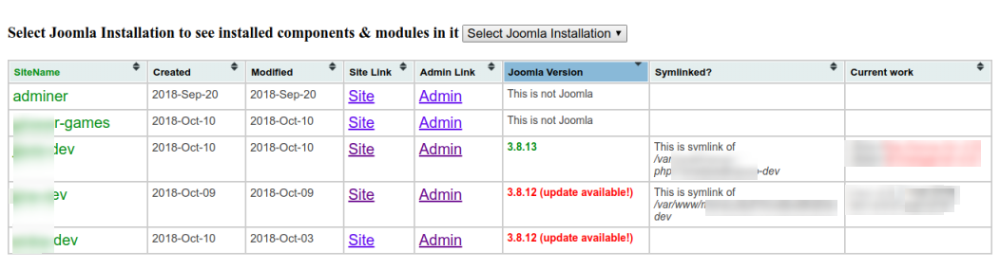

# Collection of various scripts useful for PHP development on localhost

## Scripts for Joomla

### [1. index.php](https://github.com/manojLondhe/scripts-for-localhost/blob/master/index.php)

####  How to use? 

Copy this file in your localhost root folder and access as http://localhost/index.php

####  Features

- Shows quick links to site, admin area of all Joomla installs in give localhost root directry
- Shows installed Joomla version for all Joomla installs
- Shows whether Joomla install is symlink or no
- You can also select Joomla installation to see 3rd party components & modules installed

